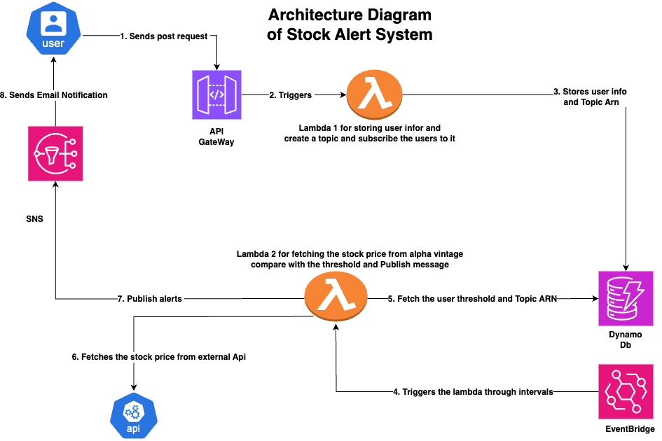

📈 **Stock Price Alert System**

🌟 **Overview** 🌟

The Stock Price Alert System is a serverless application that tracks stock prices in real-time and sends email alerts when a stock price crosses a user-defined threshold.

It is built using AWS services like Lambda, DynamoDB, API Gateway, and SNS\*\*, making it scalable, cost-effective, and fully automated.

---

Architecture

🛠 **Technologies Used**

- **AWS Lambda** – Runs backend logic to fetch stock prices and compare them with user thresholds.
- **DynamoDB** – Stores user stock preferences, Topic ARN and alert thresholds.
- **API Gateway** – Handles HTTP requests for managing stock alerts.
- **AWS SNS (Simple Notification Service)** – Sends email alerts to users.
- **Alpha Vantage API** – Retrieves real-time stock prices.
- **AWS SAM (Serverless Application Model)** – Automates deployment and infrastructure setup.

---

🚀**How to Run This Project**

1️⃣ **Clone the Repository**

To get started, first download the project files. You can do this by cloning the repository from GitHub.
Once you have cloned the project, open the project folder in your terminal or command prompt.

**git clone https://github.com/your-github-username/stock-alert-system.git**
**cd stock-alert-system**

2️⃣**Set Up AWS Credentials**

To deploy this project, you need to have AWS credentials configured on your system. If you haven’t set up AWS CLI yet, install it and run the following command:

aws configure

3️⃣ **Deploy the Project Using AWS SAM**
The project uses AWS SAM (Serverless Application Model) to deploy serverless resources like AWS Lambda, API Gateway, DynamoDB, and SNS.

Build the Project:
**sam build**

Deploy the project:
**sam deploy --guided**

After running sam deploy --guided, go to the AWS Console, navigate to API Gateway, and find the Invoke URL for your deployed API.

The format of this URL will be:

**https://<your-api-id>.execute-api.<region>.amazonaws.com/Stage/set-stock-threshold**

Use this Invoke URL as the base URL for all API requests.

4️⃣**Test the API Using Postman**

-- Add a New Stock Aler using Postman and create a new request.

--Select POST method.

--Use the API URL from deployment.

**https://your-api-gateway-url/set-stock-threshold**

--Add the Request Body:

{
"stock_symbol": "AAPL",
"threshold": 150,
"email": "user@gmail.com"
}

--You should receive a response like this:

**{
"message": "Stock alert set successfully"
}**

---

✅ Your stock alert gets saved in DynamoDB.

✅ The system will check stock prices periodically.

✅ If the price crosses the threshold, you receive an email alert via AWS SNS.

---

📌 **Notes**

Use a valid stock symbol (e.g., AAPL for Apple, TSLA for Tesla).

The threshold should be a number (e.g., 150 for $150).

The email must be valid, or AWS SNS won’t send the alert.

The alert condition specifies whether you want to receive an alert when the stock price goes above or below your threshold("above","below")

---

🔮 **Future Enhancements**

✅ Add SMS alerts using AWS SNS.

✅ Build a frontend dashboard for managing alerts

✅ Instead of checking stock prices every 10 minutes, use WebSockets to receive real-time updates only when prices change. This reduces unnecessary API calls.

✅ Use Webhooks (If API Supports It) – Some stock APIs provide webhooks that send data only when stock prices change. This avoids polling and saves costs.
